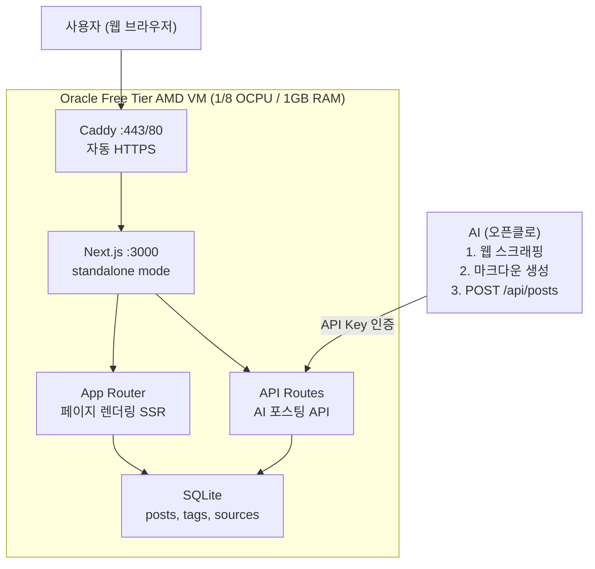
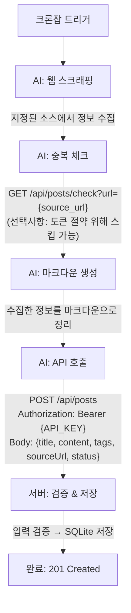
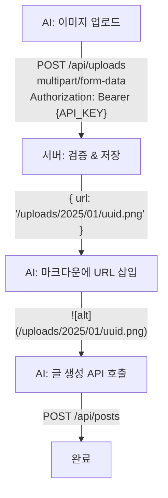
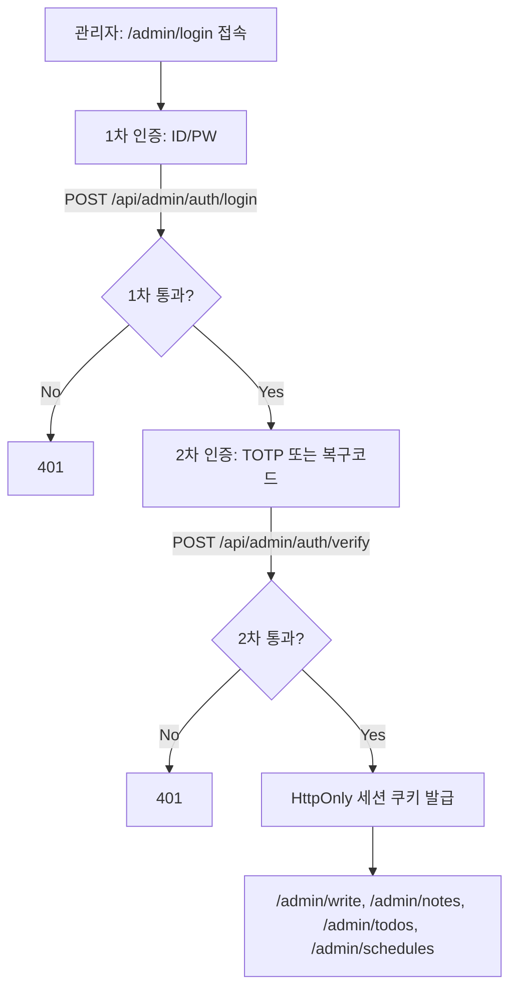
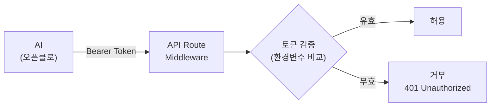
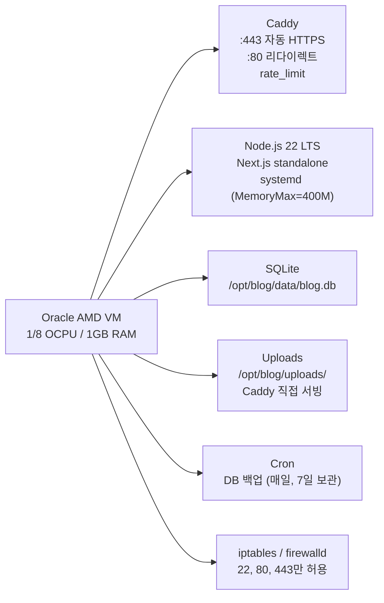
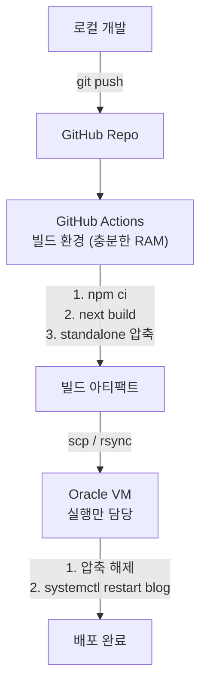
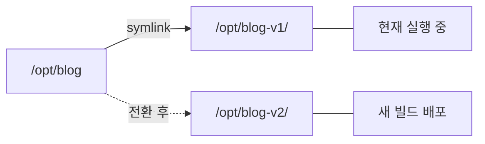

# AI 중심 개인 블로그 아키텍처 계획

## 1. 프로젝트 개요

### 목적
AI(오픈클로 등)가 크론잡을 통해 웹 스크래핑한 정보를 자동으로 블로그에 올리고,
사용자는 웹에서 편하게 읽는 것이 핵심 목적.

### 핵심 설계 원칙
| 원칙 | 설명 |
|------|------|
| **최소 토큰** | AI가 글 하나 올리는 데 필요한 토큰을 최소화 |
| **안전성** | AI가 블로그 기능을 망가뜨릴 수 없는 구조 |
| **보안** | 인증되지 않은 접근 차단 (AI: API Key, 관리자 UI: 비밀번호+TOTP 2FA) |
| **확장성** | 단순 블로그에서 시작해 기능을 점진적으로 추가 가능 |

---

## 2. 기술 스택

| 영역 | 기술 | 선정 이유 |
|------|------|-----------|
| **프레임워크** | Next.js (App Router) | React 기반, SSR/SSG 유연 전환, API Routes 내장 |
| **DB** | SQLite (via better-sqlite3) | 서버리스 DB, Oracle VM 단일 서버에 최적, 백업 간편 |
| **스타일링** | Tailwind CSS | 빠른 UI 개발, 반응형 기본 지원 |
| **마크다운 렌더링** | unified + remark + rehype + shiki | 마크다운 → HTML 변환, 서버사이드 코드 하이라이팅 |
| **배포** | Oracle Free Tier AMD VM | 무료, 1/8 OCPU (burstable) / 1GB RAM |
| **리버스 프록시** | Caddy | 자동 HTTPS 내장, 설정 간단. idle 시 30-50MB 사용 |
| **프로세스 관리** | systemd | 메모리 오버헤드 0, 커널 레벨 메모리 제한 |
| **빌드 환경** | GitHub Actions | VM은 빌드 불가 → CI에서 빌드 후 아티팩트 배포 |

---

## 3. Next.js + SQLite가 필요한 확장 시나리오

> 순수 정적 마크다운 블로그 대신 Next.js + SQLite를 선택하면 아래 기능들을 자연스럽게 추가할 수 있다.

### 3-1. 전문 검색 (Full-Text Search)
- SQLite FTS5 확장을 사용해 블로그 글 전문 검색
- 정적 사이트에서는 클라이언트에 전체 인덱스를 내려보내야 하지만, SQLite면 서버에서 즉시 검색
- 예: AI가 매일 올리는 기술 뉴스에서 특정 키워드로 과거 글 검색

### 3-2. AI 포스팅 메타데이터 추적
- AI가 언제, 어떤 소스에서, 어떤 프롬프트로 글을 생성했는지 DB에 기록
- 스크래핑 실패/중복 방지를 위한 소스 URL 중복 체크
- 예: `sources` 테이블에 원본 URL 저장 → 같은 기사 중복 포스팅 방지

### 3-3. 스케줄링 & 드래프트
- AI가 글을 `draft` 상태로 올리고, 사용자가 검토 후 `published`로 전환
- 예약 발행: `published_at` 필드로 특정 시간에 자동 공개

### 3-4. 조회수 & 통계
- 인기 글, 카테고리별 통계, AI가 올린 글 vs 직접 쓴 글 구분
- 외부 analytics 서비스 없이 자체 집계

### 3-5. 태그/카테고리 동적 필터링
- DB 쿼리로 태그 조합 필터링, 관련 글 추천
- 정적 사이트에서는 빌드 시점에 모든 조합을 생성해야 하지만 DB면 동적 처리

### 3-6. 북마크 & 읽음 표시
- 사용자가 읽은 글 추적, 나중에 읽을 글 북마크
- AI가 매일 올리는 글이 많아지면 "안 읽은 글만 보기" 필요

### 3-7. RSS/Atom 피드 동적 생성
- 카테고리별, 태그별 동적 피드 생성
- 다른 앱(Obsidian, Notion 등)에서 구독 가능

### 3-8. 간단한 API 확장
- 향후 모바일 앱, Obsidian 플러그인, Telegram 봇 등에서 블로그 데이터 접근
- Next.js API Routes가 이미 있으므로 추가 서버 불필요

### 3-9. 구독 메일링 (일간/주간 다이제스트, 비MVP)
- 구독자에게 신규 발행 글을 주기별(daily/weekly)로 묶어 발송
- `published_at` 기준 구간 조회로 발송 대상 글을 안정적으로 계산
- 발송 이력 저장으로 재시도 시 중복 발송 방지 (idempotent 처리)

---

## 4. 시스템 아키텍처



> 메일링 확장 시에는 `cron/systemd timer -> newsletter worker -> 외부 메일 API(예: Resend/SES)` 경로를 추가한다. (MVP 미포함)

---

## 5. AI 포스팅 흐름

### 5-1. AI가 글을 올리는 전체 흐름



### 5-2. AI 토큰 최소화 전략

| 전략 | 설명 |
|------|------|
| **단일 API 호출** | 글 하나 = POST 요청 하나. 멀티스텝 불필요 |
| **단순한 JSON 구조** | 필수 필드: title, content. 나머지는 선택 |
| **서버 사이드 처리** | 슬러그 생성, 날짜 기록, 태그 정규화 등은 서버가 처리 |
| **벌크 포스팅** | POST /api/posts/bulk 로 여러 글을 한 번에 전송 (API 호출 효율화, 최대 10건) |
| **서버 사이드 중복 체크** | POST 시점에 source_url 자동 체크 → 409 Conflict 반환. 별도 GET 불필요 |

### 5-3. AI 포스팅 API 최소 스펙

```
POST /api/posts
Authorization: Bearer {API_KEY}
Content-Type: application/json

{
  "title": "2025년 1월 AI 뉴스 요약",
  "content": "## 주요 뉴스\n\n- GPT-5 발표...\n- ...",
  "tags": ["ai", "news"],
  "sourceUrl": "https://example.com/article",
  "status": "published"
}
```

이것이 AI가 보내야 하는 전부. 나머지(slug, createdAt, id 등)는 서버가 자동 처리.
중복 source_url 전송 시 서버가 자동으로 `409 Conflict`를 반환.

### 5-4. 이미지 포함 글 포스팅 흐름

이미지가 포함된 글은 2-step으로 처리:



- **Step 1**: `POST /api/uploads` → 이미지 업로드 → 서버 URL 반환
- **Step 2**: 반환된 URL을 마크다운에 삽입하여 `POST /api/posts` 호출
- 또는 외부 이미지 URL(`https://...`)을 직접 사용 (로컬 업로드 없이)

### 5-5. 수동 글쓰기/관리자 워크스페이스 (Phase 3)

AI 외에 관리자도 웹 UI에서 글/메모/일정/TODO를 관리한다.



- **인증**: 비밀번호 + TOTP(Authenticator 앱) 2단계 인증 후 세션 쿠키 발급
- **세션**: `HttpOnly`, `Secure`, `SameSite=Lax` 쿠키 사용
- **복구코드**: TOTP 분실 대비 1회용 복구코드 제공, 사용 즉시 폐기
- **글쓰기**: `/admin/write`에서 글 생성/수정, 이미지 업로드 지원
- **관리 기능**: `/admin/notes`(메모 CRUD), `/admin/todos`(상태 전이), `/admin/schedules`(일정 CRUD)
- **하위 호환**: 기존 `/write`는 `/admin/write`로 리다이렉트

> Phase 1 MVP의 `/write` API Key 방식은 유지하되, Phase 3에서 admin 2FA 워크스페이스로 전환한다.

---

## 6. 보안 설계

### 6-1. AI API 인증 (서버-투-서버)



- **API Key**: 환경변수 `BLOG_API_KEY`에 저장 (최소 32바이트 랜덤 문자열)
- **Bearer Token** 방식: `Authorization: Bearer {key}`
- API Routes에서 미들웨어로 검증
- **`crypto.timingSafeEqual`로 비교** (타이밍 공격 방지)
- 잘못된 키 → 401 Unauthorized
- Caddy 로그에서 Authorization 헤더 제외 설정

### 6-1-2. 관리자 웹 인증 (비밀번호 + TOTP 2FA)

- 1차: `ADMIN_USERNAME`, `ADMIN_PASSWORD_HASH` 검증
- 2차: TOTP 6자리 코드 검증(실패 횟수 제한)
- 대체 수단: 1회용 복구코드(해시 저장, 사용 즉시 폐기)
- 최종 인증 성공 시 세션 쿠키 발급(`HttpOnly`, `Secure`, `SameSite=Lax`)
- `/api/admin/*`는 admin 세션 없으면 401
- CSRF 방어: `SameSite=Lax` + 상태 변경 요청은 CSRF 토큰(Double Submit Cookie) 검증

### 6-2. 입력 검증 & 안전장치

| 항목 | 검증 내용 |
|------|-----------|
| **title** | 빈 문자열 불가, 최대 200자 |
| **content** | 빈 문자열 불가, 최대 100,000자 (약 50페이지) |
| **tags** | 배열, 각 태그 최대 30자, 최대 10개 |
| **status** | "draft" 또는 "published"만 허용 |
| **XSS 방지** | 마크다운 렌더링 시 HTML sanitize |
| **Rate Limit** | 분당 최대 10회 요청 — **Caddy rate_limit 디렉티브**로 구현 (Next.js 부하 없이 네트워크 레이어에서 차단) |

### 6-3. 이미지 업로드 보안

| 항목 | 검증 내용 |
|------|-----------|
| **MIME 타입 화이트리스트** | image/png, image/jpeg, image/webp, image/gif만 허용 |
| **매직 바이트 검증** | 확장자뿐 아니라 파일 시그니처(file signature)로 실제 이미지인지 확인 |
| **파일명** | 사용자 제공 파일명 무시, **UUID로 교체** (경로 traversal 방지) |
| **크기 제한** | **5MB 이하** (메모리 보호, 1GB RAM 환경) |
| **서빙 시 헤더** | `X-Content-Type-Options: nosniff`, `Content-Disposition: inline` |
| **디렉토리 리스팅** | Caddy에서 browse(디렉토리 리스팅) 비활성화 |

### 6-4. SQLite 파일 보호

DB 파일과 이미지를 **물리적으로 분리**하여 웹 노출 방지:

```
/opt/blog/
├── data/
│   └── blog.db          ← Caddy에서 접근 불가 (Next.js만 접근)
└── uploads/             ← Caddy에서 직접 서빙 (이미지만)
    └── 2025/01/uuid.png
```

> Caddy 설정에서 `.db`, `.db-wal`, `.db-shm` 파일 접근을 명시적으로 차단.

### 6-5. AI 권한 범위

| 엔드포인트 | 메서드 | AI 접근 | 비고 |
|-----------|--------|---------|------|
| `/api/posts` | POST | O | 글 생성 |
| `/api/posts/bulk` | POST | O | 벌크 생성 (최대 10건) |
| `/api/uploads` | POST | O | 이미지 업로드 |
| `/api/posts/[id]` | GET | O | 글 조회 |
| `/api/posts/[id]` | PATCH | O | 글 수정 (status 변경 등) |
| `/api/posts/[id]` | DELETE | **X** | 삭제 불가 — API 미구현 |
| `/api/admin/*` | * | **X** | 관리자 2FA 세션 전용 API |

> AI는 생성과 수정만 가능. 삭제/설정 변경 API는 아예 구현하지 않아 원천 차단.

### 6-6. AI가 망가뜨릴 수 없는 구조

- 잘못된 마크다운이 와도 렌더링 오류일 뿐 서버는 안전
- SQLite WAL 모드: 읽기/쓰기 동시 가능, 데이터 손상 방지
- DB 자동 백업: 크론잡으로 .db 파일 정기 복사

### 6-7. CORS 정책

- AI 크론잡은 **서버-to-서버** 호출이므로 CORS 불필요
- 브라우저 admin UI는 same-origin으로 `/api/admin/*`를 호출
- 외부 도메인 오리진 허용은 기본 비활성 (필요 시 allowlist 기반으로 제한)

---

## 7. 데이터 모델

### posts 테이블
```sql
CREATE TABLE posts (
  id          INTEGER PRIMARY KEY AUTOINCREMENT,
  title       TEXT NOT NULL,
  slug        TEXT NOT NULL UNIQUE,
  content     TEXT NOT NULL,           -- 마크다운 원문
  status      TEXT NOT NULL DEFAULT 'draft',  -- draft | published
  source_url  TEXT,                    -- AI가 스크래핑한 원본 URL
  created_at  TEXT NOT NULL DEFAULT (datetime('now')),
  updated_at  TEXT NOT NULL DEFAULT (datetime('now')),
  published_at TEXT                    -- 공개 시점
);
```

> 메일링 확장 대비: 발송 후보 조회 성능을 위해 아래 인덱스를 권장한다.

```sql
CREATE INDEX idx_posts_status_published_at ON posts(status, published_at DESC);
```

### tags 테이블
```sql
CREATE TABLE tags (
  id   INTEGER PRIMARY KEY AUTOINCREMENT,
  name TEXT NOT NULL UNIQUE
);
```

### post_tags (다대다 관계)
```sql
CREATE TABLE post_tags (
  post_id INTEGER REFERENCES posts(id) ON DELETE CASCADE,
  tag_id  INTEGER REFERENCES tags(id) ON DELETE CASCADE,
  PRIMARY KEY (post_id, tag_id)
);
```

### sources (AI 스크래핑 메타데이터 추적)

> **중복 체크의 source of truth는 `posts.source_url`**.
> sources 테이블은 AI가 어떤 모델/프롬프트로 생성했는지 **메타데이터 추적** 용도.
> POST 시점에 서버가 `posts.source_url` 기준으로 중복을 자동 체크한다.

```sql
CREATE TABLE sources (
  id          INTEGER PRIMARY KEY AUTOINCREMENT,
  url         TEXT NOT NULL,            -- 원본 URL (posts.source_url과 동일)
  post_id     INTEGER REFERENCES posts(id) ON DELETE CASCADE,
  scraped_at  TEXT NOT NULL DEFAULT (datetime('now')),
  ai_model    TEXT,                     -- 사용된 AI 모델명
  prompt_hint TEXT                      -- 어떤 지시로 생성했는지 메모
);
```

### (Phase 3 예정) admin_auth
```sql
CREATE TABLE admin_auth (
  id                     INTEGER PRIMARY KEY CHECK (id = 1),
  username               TEXT NOT NULL UNIQUE,
  password_hash          TEXT NOT NULL,     -- Argon2id 또는 bcrypt 해시
  totp_secret_encrypted  TEXT NOT NULL,     -- TOTP 시크릿(암호화 저장)
  created_at             TEXT NOT NULL DEFAULT (datetime('now')),
  updated_at             TEXT NOT NULL DEFAULT (datetime('now'))
);
```

### (Phase 3 예정) admin_sessions
```sql
CREATE TABLE admin_sessions (
  id          TEXT PRIMARY KEY,             -- 세션 토큰 식별자(난수)
  user_id     INTEGER NOT NULL DEFAULT 1,
  created_at  TEXT NOT NULL DEFAULT (datetime('now')),
  expires_at  TEXT NOT NULL,
  last_seen_at TEXT NOT NULL DEFAULT (datetime('now')),
  ip_hash     TEXT,
  user_agent  TEXT
);
```

### (Phase 3 예정) admin_recovery_codes
```sql
CREATE TABLE admin_recovery_codes (
  id          INTEGER PRIMARY KEY AUTOINCREMENT,
  code_hash   TEXT NOT NULL UNIQUE,
  used_at     TEXT,
  created_at  TEXT NOT NULL DEFAULT (datetime('now'))
);
```

### (Phase 3 예정) admin_notes
```sql
CREATE TABLE admin_notes (
  id          INTEGER PRIMARY KEY AUTOINCREMENT,
  title       TEXT NOT NULL,
  content     TEXT NOT NULL,
  is_pinned   INTEGER NOT NULL DEFAULT 0,
  created_at  TEXT NOT NULL DEFAULT (datetime('now')),
  updated_at  TEXT NOT NULL DEFAULT (datetime('now'))
);
```

### (Phase 3 예정) admin_todos
```sql
CREATE TABLE admin_todos (
  id           INTEGER PRIMARY KEY AUTOINCREMENT,
  title        TEXT NOT NULL,
  description  TEXT,
  status       TEXT NOT NULL DEFAULT 'todo',    -- todo | doing | done
  priority     TEXT NOT NULL DEFAULT 'medium',  -- low | medium | high
  due_at       TEXT,
  completed_at TEXT,
  created_at   TEXT NOT NULL DEFAULT (datetime('now')),
  updated_at   TEXT NOT NULL DEFAULT (datetime('now'))
);
```

### (Phase 3 예정) admin_schedules
```sql
CREATE TABLE admin_schedules (
  id          INTEGER PRIMARY KEY AUTOINCREMENT,
  title       TEXT NOT NULL,
  description TEXT,
  start_at    TEXT NOT NULL,
  end_at      TEXT NOT NULL,
  is_done     INTEGER NOT NULL DEFAULT 0,
  created_at  TEXT NOT NULL DEFAULT (datetime('now')),
  updated_at  TEXT NOT NULL DEFAULT (datetime('now'))
);
```

### (확장 예정, 비MVP) newsletter_subscribers
```sql
CREATE TABLE newsletter_subscribers (
  id              INTEGER PRIMARY KEY AUTOINCREMENT,
  email           TEXT NOT NULL UNIQUE,
  status          TEXT NOT NULL DEFAULT 'pending',  -- pending | active | unsubscribed
  frequency       TEXT NOT NULL DEFAULT 'weekly',   -- daily | weekly
  timezone        TEXT NOT NULL DEFAULT 'UTC',
  confirm_token   TEXT,                              -- 더블 옵트인 확인용
  unsubscribe_token TEXT NOT NULL UNIQUE,            -- 구독 해지 링크 토큰
  created_at      TEXT NOT NULL DEFAULT (datetime('now')),
  confirmed_at    TEXT,
  unsubscribed_at TEXT
);
```

### (확장 예정, 비MVP) newsletter_deliveries
```sql
CREATE TABLE newsletter_deliveries (
  id                  INTEGER PRIMARY KEY AUTOINCREMENT,
  subscriber_id       INTEGER NOT NULL REFERENCES newsletter_subscribers(id) ON DELETE CASCADE,
  frequency           TEXT NOT NULL,                 -- daily | weekly
  period_key          TEXT NOT NULL,                 -- 예: 2026-02-14(daily), 2026-W07(weekly)
  post_ids_json       TEXT NOT NULL,                 -- 발송된 posts.id 목록(JSON 배열)
  provider_message_id TEXT,                          -- 외부 메일 서비스 message id
  status              TEXT NOT NULL DEFAULT 'queued',-- queued | sent | failed
  error_message       TEXT,
  sent_at             TEXT,
  created_at          TEXT NOT NULL DEFAULT (datetime('now')),
  UNIQUE(subscriber_id, frequency, period_key)       -- 중복 발송 방지
);
```

### schema_versions (마이그레이션 추적)
```sql
CREATE TABLE schema_versions (
  version     INTEGER PRIMARY KEY,
  applied_at  TEXT NOT NULL DEFAULT (datetime('now')),
  description TEXT
);
```

> better-sqlite3 직접 사용이므로 마이그레이션을 수동 관리.
> 각 마이그레이션 SQL에 버전 번호를 부여하고, 적용 시 schema_versions에 기록.
> 앱 시작 시 현재 버전을 확인하고 미적용 마이그레이션만 실행 (idempotent).

### 전문 검색 인덱스 (FTS5)
```sql
CREATE VIRTUAL TABLE posts_fts USING fts5(
  title, content, content='posts', content_rowid='id'
);
```

---

## 8. 디렉토리 구조 (예상)

```
.
├── src/
│   ├── app/                     # Next.js App Router
│   │   ├── layout.tsx           # 공통 레이아웃
│   │   ├── page.tsx             # 홈 (최신 글 목록)
│   │   ├── posts/
│   │   │   ├── page.tsx         # 글 목록 (필터/검색)
│   │   │   └── [slug]/
│   │   │       └── page.tsx     # 개별 글 페이지
│   │   ├── tags/
│   │   │   └── [tag]/
│   │   │       └── page.tsx     # 태그별 글 목록
│   │   ├── write/
│   │   │   └── page.tsx         # MVP 글 작성/수정 (Phase 3에서 /admin/write로 리다이렉트)
│   │   ├── admin/
│   │   │   ├── login/
│   │   │   │   └── page.tsx     # 관리자 로그인(1차/2차 인증)
│   │   │   ├── write/
│   │   │   │   └── page.tsx     # 관리자 글 작성/수정
│   │   │   ├── notes/
│   │   │   │   └── page.tsx     # 관리자 메모
│   │   │   ├── todos/
│   │   │   │   └── page.tsx     # 관리자 TODO
│   │   │   └── schedules/
│   │   │       └── page.tsx     # 관리자 일정
│   │   └── api/
│   │       ├── posts/
│   │       │   ├── route.ts     # POST: 글 생성 / GET: 목록
│   │       │   ├── bulk/
│   │       │   │   └── route.ts # POST: 벌크 포스팅 (최대 10건)
│   │       │   └── [id]/
│   │       │       └── route.ts # GET/PATCH: 개별 글 조회/수정
│   │       ├── uploads/
│   │       │   └── route.ts     # POST: 이미지 업로드
│   │       ├── admin/
│   │       │   ├── auth/
│   │       │   │   ├── login/
│   │       │   │   │   └── route.ts # POST: 관리자 1차 인증
│   │       │   │   ├── verify/
│   │       │   │   │   └── route.ts # POST: 관리자 2차 인증(TOTP/복구코드)
│   │       │   │   ├── logout/
│   │       │   │   │   └── route.ts # POST: 로그아웃
│   │       │   │   └── session/
│   │       │   │       └── route.ts # GET: 세션 확인
│   │       │   ├── notes/
│   │       │   │   └── route.ts # GET/POST
│   │       │   ├── todos/
│   │       │   │   └── route.ts # GET/POST
│   │       │   └── schedules/
│   │       │       └── route.ts # GET/POST
│   │       └── health/
│   │           └── route.ts     # GET: 헬스체크 (DB SELECT 1)
│   ├── lib/
│   │   ├── db.ts               # SQLite 연결 & 초기화 & 마이그레이션
│   │   ├── auth.ts             # API Key 검증 (crypto.timingSafeEqual)
│   │   ├── admin-auth.ts       # admin 2FA 세션/권한 검증
│   │   └── markdown.ts         # 마크다운 → HTML 변환
│   └── components/
│       ├── PostCard.tsx         # 글 카드 컴포넌트
│       ├── PostContent.tsx      # 마크다운 렌더링 컴포넌트
│       ├── SearchBar.tsx        # 검색 UI
│       └── TagList.tsx          # 태그 목록
├── data/
│   └── blog.db                 # SQLite DB (Caddy 접근 불가, Next.js만 접근)
├── uploads/                    # 이미지 저장 (Caddy에서 직접 서빙, DB와 물리 분리)
│   └── 2025/01/uuid.png
├── scripts/
│   ├── backup-db.sh            # DB 백업 스크립트
│   ├── migrate.ts              # DB 마이그레이션
│   ├── test-step-{1..7}.mjs    # Step별 자동화 테스트
│   └── test-all.mjs            # 전체 회귀 테스트
├── next.config.ts              # standalone 출력 설정
├── package.json
└── .env.local                  # BLOG_API_KEY 등 환경변수
```

---

## 9. Oracle Free Tier 배포 구조

### 9-1. VM 스펙 (Always Free)

| 항목 | 값 |
|------|-----|
| **인스턴스** | VM.Standard.E2.1.Micro (AMD) |
| **OCPU** | 1/8 OCPU (burstable, 최대 1 OCPU = 2 vCPU) |
| **메모리** | 1GB |
| **디스크** | 50GB 부트 볼륨 (무료, Always Free 전체 200GB 할당) |
| **네트워크** | 공인 IP 무료, 월 10TB 아웃바운드 |
| **OS** | Oracle Linux 8 또는 Ubuntu 22.04 (Minimal) |

> **주의**: 기본 CPU 베이스라인은 물리 코어의 12.5%. 일시적으로 버스트 가능하지만
> 지속적 CPU 부하 작업(빌드 등)에는 부적합. 블로그 서빙 용도로는 충분.

### 9-2. 1GB RAM 제약 분석

> **이 섹션이 아키텍처의 가장 중요한 제약 사항이다.**

#### 메모리 예산

| 구성 요소 | 일반 | 최악 | 비고 |
|-----------|------|------|------|
| OS (커널 + 기본 프로세스) | ~300MB | ~400MB | Minimal 이미지, buffers/cache 포함 |
| Caddy (리버스 프록시) | ~30MB | ~50MB | Go 런타임 GC 오버헤드 포함 |
| Node.js + Next.js standalone | ~250MB | ~400MB | shiki 언어 로딩 포함, SSR 피크 시 |
| SQLite | ~5MB | ~10MB | 인메모리 캐시 최소화 시 |
| **합계** | **~585MB** | **~860MB** | |
| **여유분** | **~439MB** | **~164MB** | 최악 시 여유 매우 적음 |

> **최적화 필수**: shiki 언어 로딩을 필요한 5-10개 언어로 제한해야 메모리 절약 가능.
> VM 셋업 후 `free -m`으로 실제 OS 메모리 사용량을 확인하고 예산을 재검증할 것.

#### 핵심 제약: VM에서 빌드 불가

`next build`는 1~2GB RAM을 소모하므로 **VM에서 직접 빌드할 수 없다.**

해결책: **GitHub Actions에서 빌드 → 빌드 아티팩트만 VM에 배포**

#### 메모리 최적화 필수 설정

```bash
# Node.js 힙 메모리 제한 (서버 실행 시)
NODE_OPTIONS="--max-old-space-size=256"
```

> **힙 256MB + 비힙(native 모듈, 스택, Buffer 등) ~100-150MB = ~400MB**
> 이것이 systemd MemoryMax=400M 설정의 근거.

> swap 없이 운영. 메모리 초과 시 OOM killer → systemd 자동 재시작.
> 개인 블로그이므로 순간적인 재시작은 허용 가능.

#### OOM 발생 가능 시나리오 & 대응

| 시나리오 | 원인 | 대응 |
|---------|------|------|
| 봇/크롤러 동시 요청 | 요청마다 SSR + shiki 렌더링 | Caddy rate_limit 디렉티브로 차단 |
| 벌크 포스팅 + 웹 요청 동시 | 메모리 피크 중첩 | 벌크 최대 10건 제한 |
| 이미지 업로드 | multipart/base64 파싱 시 파일 크기만큼 메모리 | 업로드 5MB 제한 |
| 대량 TLS 핸드셰이크 | Caddy 메모리 일시 증가 | Caddy rate_limit으로 완화 |

### 9-3. 서버 구성



### 9-4. 배포 플로우 (CI/CD 빌드 필수)



### 9-5. 배포 전략: 심볼릭 링크 전환 + 롤백



**배포 절차**:
1. 새 빌드를 `/opt/blog-v{N}/`에 압축 해제
2. `/opt/blog` 심볼릭 링크를 새 버전으로 전환: `ln -sfn /opt/blog-v{N} /opt/blog`
3. `systemctl restart blog`
4. 이전 버전 2-3개 보관 (롤백용)

**롤백 절차**:
1. `ln -sfn /opt/blog-v{N-1} /opt/blog`
2. `systemctl restart blog`
3. 30초 이내 복구 가능

### 9-6. systemd 서비스 예시

```ini
# /etc/systemd/system/blog.service
[Unit]
Description=Blog Next.js App
After=network.target

[Service]
Type=simple
User=blog
WorkingDirectory=/opt/blog
ExecStart=/usr/bin/node server.js
Restart=always
RestartSec=5

# Graceful shutdown (진행 중인 DB 트랜잭션 완료 대기)
TimeoutStopSec=10

# 메모리 제한 (OOM 방지)
# 힙 256MB + 비힙(native, 스택, Buffer) ~100-150MB = ~400MB
MemoryMax=400M
MemoryHigh=300M

Environment=NODE_ENV=production
Environment=NODE_OPTIONS=--max-old-space-size=256
Environment=PORT=3000

[Install]
WantedBy=multi-user.target
```

### 9-7. Caddy 설정 예시

```
# /etc/caddy/Caddyfile
blog.example.com {
    # 이미지 직접 서빙 (Next.js 거치지 않음 → 메모리 절약)
    handle /uploads/* {
        root * /opt/blog
        file_server {
            # 디렉토리 리스팅 비활성화 (browse 미사용)
        }
        header X-Content-Type-Options nosniff
    }

    # DB 파일 접근 차단
    @blocked path *.db *.db-wal *.db-shm
    respond @blocked 403

    # API + 페이지
    handle {
        reverse_proxy localhost:3000
    }

    encode gzip

    # Rate limiting (API 보호)
    rate_limit {
        zone api_zone {
            key {remote_host}
            events 10
            window 1m
        }
    }
}
```

> Caddy는 Let's Encrypt 인증서를 자동으로 발급/갱신한다.
> 초기 설정 시 OCI Security List에서 포트 80, 443 인바운드를 반드시 열어야 함.

---

## 10. 대안 비교: 왜 Oracle VM인가?

| | Oracle Free Tier | Cloudflare Pages | Vercel | GitHub Pages |
|---|---|---|---|---|
| **비용** | 무료 | 무료 | 무료 (제한) | 무료 |
| **서버 사이드** | O (Node.js) | Edge Workers | Serverless | X |
| **SQLite** | O (파일 DB) | X | X (서버리스) | X |
| **커스텀 도메인** | O | O | O | O |
| **자유도** | 최고 | 제한적 | 제한적 | 최저 |
| **관리 부담** | 높음 | 없음 | 없음 | 없음 |

**결론**: SQLite를 사용하려면 파일시스템 접근이 필요하므로 Oracle VM이 적합.
서버리스 환경(Vercel, Cloudflare)에서는 SQLite 대신 별도 DB 서비스가 필요하여 복잡도 증가.

---

## 11. 구현 단계 (로드맵)

> **상세 구현 계획 및 테스트는 `plans/implementation-plan.md` 참조.**
> Phase 1~4 로드맵, 각 Step별 구현 내용, 통과 기준, 테스트 목록이 통합되어 있다.
> 구독 메일링(일간/주간)은 Phase 4 확장 범위로 관리한다. (MVP 제외)

---

## 12. 결정 완료 사항

| # | 항목 | 결정 | 비고 |
|---|------|------|------|
| 1 | ORM | **better-sqlite3 직접 사용** | 의존성 최소, 메모리 절약, raw SQL |
| 2 | 커스텀 도메인 | **사용** | Caddy 자동 HTTPS 적용 |
| 3 | 이미지 저장 | **로컬 디스크** | 50GB 부트 볼륨 활용 |
| 4 | 관리자 페이지 | **관리자 워크스페이스(글/메모/일정/TODO)** | 인증은 비밀번호 + TOTP 2FA + 세션 |
| 5 | 마크다운 기능 | **Tier 1~4 전부** | GFM + shiki + KaTeX + Mermaid(클라이언트) |
| 6 | 다크모드 | **미지원** | MVP에서 제외 |
| 7 | 패키지 매니저 | **npm** | Node.js 기본 내장 |
| 8 | Node.js 버전 | **22 LTS** | 2027-04까지 지원 |

### 12-1. ORM 비교 분석

#### Option A: better-sqlite3 직접 사용

| 장점 | 단점 |
|------|------|
| 의존성 1개 (better-sqlite3만) | 타입 안전성 없음 (런타임 에러 가능) |
| 동기 API → 코드 단순 | 마이그레이션 직접 관리 필요 |
| SQLite 모든 기능 직접 사용 (FTS5, JSON 함수) | SQL injection 주의 (prepared statement 필수) |
| 메모리 사용량 최소 | 스키마 변경 시 수동 추적 |
| AI가 raw SQL을 잘 이해 → 유지보수 시 유리 | |

#### Option B: Drizzle ORM

| 장점 | 단점 |
|------|------|
| TypeScript 타입 안전 | 추가 의존성 (drizzle-orm + drizzle-kit) |
| 스키마를 코드로 관리 (마이그레이션 자동) | FTS5 등 고급 기능은 결국 raw SQL 필요 |
| SQL-like 문법이라 학습 곡선 낮음 | 추상화 레이어 추가 |
| better-sqlite3 기반이라 동기 API 유지 | |
| 번들 사이즈 작음 (~40KB uncompressed, ~7.4KB min+gzip) | |

#### Option C: Prisma (비추천)

| 장점 | 단점 |
|------|------|
| 풍부한 에코시스템 | **무거움** (v7+에서 바이너리 1.6MB로 축소되었으나 런타임 메모리 여전히 높음) |
| 강력한 타입 생성 | SQLite FTS5 미지원 |
| | 빌드 시 Prisma Client 생성 단계 필요 |

#### 분석 요약

이 프로젝트는 테이블 4~5개의 소규모 프로젝트.

- **메모리 최우선이면** → better-sqlite3 직접 사용
- **타입 안전 + 마이그레이션 자동화 원하면** → Drizzle
- Prisma는 1GB 환경에서 비추천

> **결정: better-sqlite3 직접 사용** — 의존성 최소화, 메모리 절약, FTS5 등 SQLite 전체 기능 직접 활용. Prepared statement 사용으로 SQL injection 방지.

### 12-2. 마크다운 기능 범위 분석

AI가 생성하는 콘텐츠의 형식을 결정하는 중요한 설계 사항.
지원 범위가 넓을수록 렌더링 파이프라인이 복잡해지고 번들 크기가 증가한다.

#### Tier 1: 기본 마크다운 (필수)

별도 플러그인 없이 기본 지원되는 기능.

- 제목 (h1~h6)
- 본문 텍스트, 볼드, 이탤릭, 인라인 코드
- 순서 있는/없는 목록
- 링크, 이미지 (``)
- 인용문 (blockquote)
- 수평선
- 테이블

#### Tier 2: GFM 확장 (강력 추천)

`remark-gfm` 플러그인 하나로 지원. 추가 비용 거의 없음.

- ~~취소선~~
- Task list (체크박스)
- 자동 링크 (URL → 클릭 가능)
- 각주 (footnotes)
- 테이블 정렬

#### Tier 3: 코드 블록 구문 하이라이팅 (강력 추천)

기술 블로그에 필수. 라이브러리 선택이 필요함.

| 라이브러리 | 렌더링 위치 | 번들 크기 | 특징 |
|-----------|------------|----------|------|
| **shiki** | 서버 (빌드/SSR) | 클라이언트 0KB | VS Code 테마 호환, 정확한 하이라이팅 |
| Prism | 클라이언트 | ~20-40KB | 가볍지만 클라이언트 JS 필요 |
| highlight.js | 클라이언트 | ~30-50KB | 언어 지원 넓음 |

**추천: shiki** (rehype-shiki)
- SSR이므로 클라이언트에 JS 번들 0
- Next.js App Router와 자연스러운 통합
- `\`\`\`python` 같은 언어 지정만 하면 자동 하이라이팅

#### Tier 4: 선택적 확장 기능

~~필요에 따라 개별적으로 추가 가능. MVP에서는 제외 권장.~~
**결정: MVP에 포함.** 수학 수식(KaTeX)과 Mermaid 다이어그램(클라이언트 렌더링)을 MVP에서 지원.

| 기능 | 플러그인 | 비용/영향 | 필요 상황 |
|------|---------|----------|----------|
| **수학 수식** | rehype-katex | 클라이언트 CSS ~100KB | AI가 수학/통계 콘텐츠를 올릴 때 |
| **Mermaid 다이어그램** | 클라이언트 렌더링 | ~500KB 번들 | 아키텍처/플로우 설명 글 |
| **YouTube 임베드** | 커스텀 remark 플러그인 | CSP 헤더 설정 필요 | 영상 링크 포함 콘텐츠 |
| **Callout/Admonition** | remark-directive | 경미 | 정보/경고/위험 박스 UI |

> **주의**: Mermaid를 서버에서 렌더링(puppeteer)하려면 메모리가 필요하므로
> 1GB VM에서는 **클라이언트 렌더링만 가능**. 또는 아예 미지원도 방법.

#### 렌더링 파이프라인 (확정)

```
마크다운 원문
  │
  ▼
unified()
  .use(remarkParse)         ← 마크다운 파싱
  .use(remarkGfm)           ← GFM 확장 (Tier 2)
  .use(remarkMath)          ← 수학 수식 파싱 (Tier 4)
  .use(remarkRehype)        ← HTML 변환
  .use(rehypeShiki)         ← 코드 하이라이팅 (Tier 3)
  .use(rehypeKatex)         ← 수식 렌더링 (Tier 4)
  .use(rehypeSanitize)      ← XSS 방지 (커스텀 스키마)
  .use(rehypeStringify)     ← HTML 문자열 출력
  │
  ▼
HTML (안전한 렌더링 결과)
+ Mermaid 코드 블록 → 클라이언트에서 dynamic import로 렌더링
```

### 12-3. 이미지 저장 설계 (로컬 디스크)

```
/opt/blog/
├── data/
│   └── blog.db              ← SQLite DB (Caddy 접근 불가)
├── uploads/                  ← 이미지 저장 (DB와 물리 분리)
│   └── 2025/
│       └── 01/
│           └── a1b2c3d4.png  ← UUID 파일명
```

- AI가 이미지 올릴 때: `POST /api/uploads` (multipart/form-data)
- **파일명은 UUID로 교체** (경로 traversal 방지)
- **MIME 타입 + 매직 바이트 이중 검증** (악성 파일 차단)
- **5MB 크기 제한** (메모리 보호)
- Caddy에서 `/uploads/*` 경로를 직접 서빙 (Next.js 거치지 않음 → 메모리 절약)
- `X-Content-Type-Options: nosniff` 헤더로 MIME sniffing 방지
- 50GB 디스크 중 OS + 앱이 ~5GB 사용 → 이미지에 ~45GB 사용 가능
- 이미지 평균 500KB 기준 약 90,000개 저장 가능

### 12-4. 에러 핸들링 전략

#### API 에러 응답 포맷

모든 API 에러는 동일한 JSON 구조로 반환:

```json
{
  "error": "에러 메시지 (사람이 읽을 수 있는 설명)",
  "code": "ERROR_CODE"
}
```

#### HTTP 상태 코드 매핑

| 상태 코드 | 에러 코드 | 상황 |
|-----------|----------|------|
| 400 | `INVALID_INPUT` | 입력 검증 실패 (title 누락 등) |
| 401 | `UNAUTHORIZED` | API Key 없음 또는 잘못됨 |
| 409 | `DUPLICATE_SOURCE` | source_url 중복 |
| 413 | `FILE_TOO_LARGE` | 이미지 크기 초과 (5MB) |
| 415 | `UNSUPPORTED_TYPE` | 허용되지 않는 파일 타입 |
| 429 | `RATE_LIMITED` | 요청 횟수 초과 |
| 500 | `INTERNAL_ERROR` | 서버 내부 오류 |

#### AI 재시도 전략

- 4xx 에러: 재시도하지 않음 (입력 문제)
- 429: 1분 후 재시도
- 5xx: 최대 3회 재시도 (30초 간격)

### 12-5. 로깅 전략

1GB 환경에서 별도 로깅 라이브러리(winston, pino) 대신 **`console.log` JSON + systemd journal** 활용:

```json
{"level":"info","ts":"2025-01-01T00:00:00Z","method":"POST","path":"/api/posts","status":201,"duration_ms":45}
{"level":"error","ts":"2025-01-01T00:00:05Z","method":"POST","path":"/api/posts","error":"INVALID_INPUT","message":"title is required"}
```

- systemd journal이 자동 수집 (`journalctl -u blog`)
- logrotate로 보존 기간 관리
- 별도 의존성 없음, 메모리 오버헤드 없음

---

## 13. 아키텍처 외 사전 결정 사항

> 구현 전에 정해야 하지만 코드 아키텍처와는 별개인 항목들.

### 13-1. 인프라 & 도메인

| 항목 | 결정 필요 내용 | 상태 |
|------|--------------|------|
| 도메인 구매 | 도메인 이름, 구매처 (Cloudflare, Namecheap 등) | 미결정 |
| DNS 설정 | A 레코드 → Oracle VM 공인 IP | 도메인 구매 후 |
| Oracle VM OS | Oracle Linux 8 vs Ubuntu 22.04 Minimal | 미결정 |
| SSH 보안 | 키 인증만 허용, 패스워드 인증 비활성화 | 구현 시 |

### 13-2. 보안 강화

| 항목 | 설명 | 우선순위 |
|------|------|---------|
| fail2ban | SSH 브루트포스 차단 | 높음 |
| Oracle Security List | 22/80/443 외 포트 차단 (VM 외부 방화벽) | 높음 |
| API Key 관리 | 키 생성 방법, 로테이션 주기, 유출 시 대응 | 중간 |
| CORS 설정 | API를 외부에서 호출 허용할 범위 | 중간 |

### 13-3. 백업 & 복구

| 항목 | 결정 필요 내용 |
|------|--------------|
| 백업 주기 | 매일? 매주? |
| 백업 대상 | blog.db + uploads/ 디렉토리 |
| 백업 저장 위치 | 같은 VM 내 다른 경로 vs 외부 (GitHub, OCI Object Storage 무료 등) |
| 보관 기간 | 최근 N일분만 유지? |
| 복구 절차 | 문서화 필요 |

### 13-4. 모니터링

| 항목 | 추천 도구 | 비용 |
|------|----------|------|
| Uptime 모니터링 | UptimeRobot | 무료 (50개 모니터) |
| 서버 다운 알림 | UptimeRobot → 이메일/Telegram | 무료 |
| 디스크 사용량 | cron + 쉘 스크립트 | 무료 |
| 에러 로그 | journalctl + logrotate | 무료 (기본 내장) |

### 13-5. 개발 환경 & 워크플로우

| 항목 | 결정 필요 내용 |
|------|--------------|
| 패키지 매니저 | **npm** (확정) |
| Node.js 버전 | **22 LTS** (확정) |
| 린터/포매터 | ESLint + Prettier 사용 여부 |
| 테스트 | API 엔드포인트 테스트 (vitest 등) 범위 |
| Git 브랜칭 | main만 사용 vs feature branch |
| 커밋 컨벤션 | Conventional Commits 등 |

### 13-6. 콘텐츠 전략

| 항목 | 결정 필요 내용 |
|------|--------------|
| AI 스크래핑 소스 | 어떤 사이트/RSS를 스크래핑할지 목록 |
| 카테고리/태그 체계 | 사전 정의 vs AI가 자유롭게 태그 생성 |
| 포스팅 빈도 | 매일? 매주? 이벤트 기반? |
| 콘텐츠 검수 | AI가 바로 published vs 항상 draft로 올리고 수동 검수 |

### 13-7. 성능 전략

| 항목 | 설명 |
|------|------|
| 페이지 렌더링 | SSR (요청마다 렌더링) vs ISR (주기적 재생성) |
| 이미지 최적화 | Next.js Image 컴포넌트 사용 여부 (1GB에서 sharp 라이브러리 메모리 주의) |
| Caddy 캐싱 | 정적 자원 Cache-Control 헤더 설정 |
| DB 쿼리 최적화 | 인덱스 전략, 페이지네이션 방식 |

### 13-8. 메일링 운영 정책 (확장 시 결정)

| 항목 | 결정 필요 내용 |
|------|--------------|
| 옵트인 방식 | 단일 옵트인 vs 더블 옵트인(권장) |
| 발송 시점 기준 | UTC 기준 vs 사용자 타임존 기준 |
| 발송 정책 | 매일/매주 정확한 발송 시각, 재시도 횟수 |
| 구독 해지 | 메일 본문 1-click 해지 링크 필수 여부 |
| 발송 서비스 | Resend / Amazon SES / SendGrid 중 선택 |
